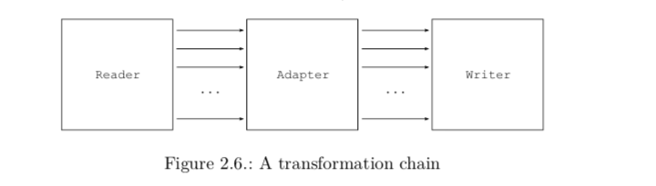

<!-- TOC -->

- [0.1. Classes](#01-classes)
    - [0.1.1. 常用类](#011-常用类)
        - [0.1.1.1. ClassReader](#0111-classreader)
        - [0.1.1.2. ClassVisitor](#0112-classvisitor)
        - [0.1.1.3. ClassWriter](#0113-classwriter)
        - [ClassVisitor必须按照指定的顺便进行访问](#classvisitor必须按照指定的顺便进行访问)
        - [0.1.1.4. 使用ClassWriter定义的类](#0114-使用classwriter定义的类)
    - [0.1.2. 转换类](#012-转换类)
    - [0.1.3. 删除类成员](#013-删除类成员)
    - [0.1.4. 添加成员](#014-添加成员)
    - [0.1.5. 工具](#015-工具)
        - [0.1.5.1. Type](#0151-type)
        - [0.1.5.2. TraceClassVisitor](#0152-traceclassvisitor)
        - [0.1.5.3. CheckClassAdapter](#0153-checkclassadapter)
        - [0.1.5.4. ASMifier](#0154-asmifier)
- [0.2. Methods](#02-methods)
        - [0.2.0.5. ClassWriter Options](#0205-classwriter-options)

<!-- /TOC -->
## 0.1. Classes
### 0.1.1. 常用类
#### 0.1.1.1. ClassReader
解析一个编译后的类（字节码形式的byte array），调用ClassVisitor对象对应的visitXXX方法，ClassVisitor对象通过ClassReader.accept方法的参数传入.Class可以看做是时间的生产者。

#### 0.1.1.2. ClassVisitor
代理所有的方法调用给其他的ClassVisitor对象，可以看做是一个Event Filter。

#### 0.1.1.3. ClassWriter
ClassWriter继承了ClassVisitor，它生成类的字节码，可以看做是事件的消费者。

#### ClassVisitor必须按照指定的顺便进行访问
```
    public abstract class ClassVisitor {
        public ClassVisitor(int api);

        public ClassVisitor(int api, ClassVisitor cv);
        public void visit(int version, int access, String name,   String signature, String superName, String[] interfaces);
        public void visitSource(String source, String debug);

        public void visitOuterClass(String owner, String name, String desc);

        AnnotationVisitor visitAnnotation(String desc, boolean visible);

        public void visitAttribute(Attribute attr);

        public void visitInnerClass(String name, String outerName,
                                    String innerName, int access);

        public FieldVisitor visitField(int access, String name, String desc,
                                       String signature, Object value);

        public MethodVisitor visitMethod(int access, String name, String desc,
                                         String signature, String[] exceptions);

        void visitEnd();
    }
```

#### 0.1.1.4. 使用ClassWriter定义的类
如果产生使用类由使用的环境所决定，如果你正在实现一个编译器，类生成则由AST驱动，生成的类则会保存在硬盘上。如果是使用动态代理，则类的生成可以使用ClassLoader实现。
- 可以把类定义保存在.class文件，方便以后使用。
- 定义一个ClassLoader,使用defineClass方法
```
    class MyClassLoader extends ClassLoader {
          public Class defineClass(String name, byte[] b) {
            return defineClass(name, b, 0, b.length);
          }
}
```
使用类:
```
Class c = myClassLoader.defineClass(cName, b);
cName是类internal name， b是byte array.
```
- 使用ClassLoader的findClass方法
```
    class StubClassLoader extends ClassLoader {
        @Override
        protected Class findClass(String name) throws ClassNotFoundException {
          if (name.endsWith("_Stub")) {
            ClassWriter cw = new ClassWriter(0);
            ...
            byte[] b = cw.toByteArray();
            return defineClass(name, b, 0, b.length);
          }
          return super.findClass(name);
        }
    }
```

### 0.1.2. 转换类
组合ClassReader, ClassVisitor, ClassWriter. ClassReader读取一个类的定义，ClassVisitor对类的定义进行修改，ClassWriter生成转换后的类定义。

```
byte[] b1 = ...;
ClassWriter cw = new ClassWriter(0);
// cv forwards all events to cw
ClassVisitor cv = new ClassVisitor(ASM4, cw) { };
ClassReader cr = new ClassReader(b1);
cr.accept(cv, 0);
byte[] b2 = cw.toByteArray(); // b2 represents the same class as b1
```

### 0.1.3. 删除类成员
对于返回值是空的成员访问，只要不forword method call，即可删除内容。
如下删除内部类、外部类和源文件信息。
```

      public class RemoveDebugAdapter extends ClassVisitor {
        public RemoveDebugAdapter(ClassVisitor cv) {
          super(ASM4, cv);
        }
        @Override
        public void visitSource(String source, String debug) {
        }
        @Override
        public void visitOuterClass(String owner, String name, String desc) {
        }
        @Override
        public void visitInnerClass(String name, String outerName,
            String innerName, int access) {
        }
}
```
上述方法对于字段和方法不起作用，因为visitField和visitMethod必须有返回值。可以通过返回null来删除部分成员。
下面通过方法名和类型描述符删除某个方法。
```
   public class RemoveMethodAdapter extends ClassVisitor {
        private String mName;
        private String mDesc;
        public RemoveMethodAdapter(
            ClassVisitor cv, String mName, String mDesc) {
            super(ASM4, cv);
            this.mName = mName;
            this.mDesc = mDesc;
        }
        @Override
        public MethodVisitor visitMethod(int access, String name,
            String desc, String signature, String[] exceptions) {
          if (name.equals(mName) && desc.equals(mDesc)) {
            // do not delegate to next visitor -> this removes the method
            return null;
}
          return cv.visitMethod(access, name, desc, signature, exceptions);
        }
}
```
### 0.1.4. 添加成员
添加Field可以通过调用visitField方法实现，但是visitField的方法调用必须放在合适的位置。比如不同在调用visit()方法的时候调用visitField，因为这样可能导致调用visitField之后调用visitSource、visitAnnotation等方法，这种访问顺序是不合法的。如果添加在visitField或者visitMethod方法中，会导致有几个字段或者有几个方法，就添加了几个字段。更常用的方式是添加在visitEnd方法中，如下：
```

      public class AddFieldAdapter extends ClassVisitor {
        private int fAcc;
        private String fName;
        private String fDesc;
        private boolean isFieldPresent;
        public AddFieldAdapter(ClassVisitor cv, int fAcc, String fName,
            String fDesc) {
          super(ASM4, cv);
          this.fAcc = fAcc;
          this.fName = fName;
          this.fDesc = fDesc;
        }
        @Override
        public FieldVisitor visitField(int access, String name, String desc,
            String signature, Object value) {
          if (name.equals(fName)) {
            isFieldPresent = true;
}
          return cv.visitField(access, name, desc, signature, value);
        }
        @Override
        public void visitEnd() {
          if (!isFieldPresent) {
            FieldVisitor fv = cv.visitField(fAcc, fName, fDesc, null, null);
            if (fv != null) {
              fv.visitEnd();
            }
}
          cv.visitEnd();
        }
}
```
### 0.1.5. 工具
ASM出于性能考虑，没有把internal name和type descriptors转换成java 源文件中的表达方式，可以通过Type手动的进行转换。
#### 0.1.5.1. Type
Type代表一个Java Type,可以通过类和类型描述符构造。
```
    String name = Type.getType("Ljava/lang/String;");
    String stringInternalName = Type.getType(String.class);     

    Type.getInternalName()只对Class或者interface有效。
    原子类型的Type可以通过Type.INT_TYPE等获得。

    Type.getDescriptor()返回类型描述符:
    Type.getType("Ljava/lang/String;").getDescriptor(); // Ljava/lang/String;
```

Type也可以表示一个方法类型，可以通过Method对象构造，此时getDescriptor返回方法描述法
```
        Method method = String.class.getMethod("substring", int.class);
        System.out.println(Type.getType(method).getDescriptor());
        Type[] types = Type.getType(method).getArgumentTypes();
        Type returnType = Type.getType(method).getReturnType();
```
Type也可以直接解析类型描述符，返回对应的Type
```
        Type[] arguTypes = Type.getArgumentTypes("(I)V"); // [Type.INT_TYPE]
        Type retType = Type.getReturnType("(I)V");  //Type.VOID_TYPE
        
```

#### 0.1.5.2. TraceClassVisitor
以可读的方式输出生成的类：
```
    ClassWriter classWriter = new ClassWriter(0);
    PrintWriter printWriter = new PrintWriter(System.out);
    TraceClassVisitor traceClassVisitor = new TraceClassVisitor(classWriter, printWriter);
    ClassReader classReader = new ClassReader("java/lang/Runnable");
    classReader.accept(traceClassVisitor, 0);
```
产生如下输出
```
// class version 52.0 (52)
// access flags 0x601
public abstract interface java/lang/Runnable {

  // compiled from: Runnable.java

  @Ljava/lang/FunctionalInterface;()

  // access flags 0x401
  public abstract run()V
}
```

#### 0.1.5.3. CheckClassAdapter
ClassWriter并不检查生成的字节码，它可以生成JVM拒绝的字节码；CheckClassAdapter可以检查生成后的字节码是否正确。
```
ClassWriter cw = new ClassWriter(0);
TraceClassVisitor tcv = new TraceClassVisitor(cw, printWriter); 
CheckClassAdapter cv = new CheckClassAdapter(tcv); 
cv.visit(...);
...
cv.visitEnd();
byte b[] = cw.toByteArray();
```

#### 0.1.5.4. ASMifier
ASM可以根据java字节码反推出用ASM生成一样代码的ASM代码。修改上述示例，加入ASMifier给TraceClassVisitor对象：
```
        ClassWriter classWriter = new ClassWriter(0);
        PrintWriter printWriter = new PrintWriter(System.out);
        ASMifier asMifier = new ASMifier();
        TraceClassVisitor traceClassVisitor = new TraceClassVisitor(classWriter, asMifier, printWriter);
        ClassReader classReader = new ClassReader("java/lang/Runnable");
        classReader.accept(traceClassVisitor, 0);
```
输出结果为：
```
package asm.java.lang;
import java.util.*;
import jdk.internal.org.objectweb.asm.*;
public class RunnableDump implements Opcodes {

public static byte[] dump () throws Exception {

ClassWriter cw = new ClassWriter(0);
FieldVisitor fv;
MethodVisitor mv;
AnnotationVisitor av0;

cw.visit(52, ACC_PUBLIC + ACC_ABSTRACT + ACC_INTERFACE, "java/lang/Runnable", null, "java/lang/Object", null);

cw.visitSource("Runnable.java", null);

{
av0 = cw.visitAnnotation("Ljava/lang/FunctionalInterface;", true);
av0.visitEnd();
}
{
mv = cw.visitMethod(ACC_PUBLIC + ACC_ABSTRACT, "run", "()V", null, null);
mv.visitEnd();
}
cw.visitEnd();

return cw.toByteArray();
}
}
```
IntelliJ有对应的插件，不用手动调用。

## 0.2. Methods
ASM API通过MethodVisitor产生和转换编译后的方法。方法的调用顺便必须按照如下顺序进行：
```
visitAnnotationDefault?
( visitAnnotation | visitParameterAnnotation | visitAttribute )* ( visitCode
( visitTryCatchBlock | visitLabel | visitFrame | visitXxxInsn | visitLocalVariable | visitLineNumber )*
visitMaxs )? visitEnd
```

MethodVisitor类：
```
abstract class MethodVisitor { // public accessors ommited MethodVisitor(int api);
MethodVisitor(int api, MethodVisitor mv);
AnnotationVisitor visitAnnotationDefault();
AnnotationVisitor visitAnnotation(String desc, boolean visible); AnnotationVisitor visitParameterAnnotation(int parameter,
String desc, boolean visible);
void visitAttribute(Attribute attr);
void visitCode();
void visitFrame(int type, int nLocal, Object[] local, int nStack,
Object[] stack);
void visitInsn(int opcode);
void visitIntInsn(int opcode, int operand);
void visitVarInsn(int opcode, int var);
void visitTypeInsn(int opcode, String desc);
void visitFieldInsn(int opc, String owner, String name, String desc); void visitMethodInsn(int opc, String owner, String name, String desc); void visitInvokeDynamicInsn(String name, String desc, Handle bsm,
Object... bsmArgs);
void visitJumpInsn(int opcode, Label label);
void visitLabel(Label label);
void visitLdcInsn(Object cst);
void visitIincInsn(int var, int increment);
void visitTableSwitchInsn(int min, int max, Label dflt, Label[] labels); void visitLookupSwitchInsn(Label dflt, int[] keys, Label[] labels);
void visitMultiANewArrayInsn(String desc, int dims);
void visitTryCatchBlock(Label start, Label end, Label handler,
            String type);
        void visitLocalVariable(String name, String desc, String signature,
Label start, Label end, int index);
void visitLineNumber(int line, Label start); void visitMaxs(int maxStack, int maxLocals); void visitEnd();
}
```

ClassVisitor可以和Method一起使用生成代码：
```

      ClassVisitor cv = ...;
      cv.visit(...);
      MethodVisitor mv1 = cv.visitMethod(..., "m1", ...);
      mv1.visitCode();
      mv1.visitInsn(...);
      ...
      mv1.visitMaxs(...);
      mv1.visitEnd();
      MethodVisitor mv2 = cv.visitMethod(..., "m2", ...);
      .....
      cv.visitEnd();
```

ASM提供三个构建在MethodVisitors上面的核心组件：
组件|说明
--|--
ClassReader | ClassReader解析字节码，调用其accept的ClassVisitor对象中的返回MethodVisitor的方法。
ClassWriter|ClassWriter的visitMethod方法直接返回一个MethodVisitor的实现，它直接以二进制的方式构建编译后的方法实现。
MethodVisitor | MethodVisitor代理所有它接收的调用给另外一个MethodVisitor对象。

#### 0.2.0.5. ClassWriter Options
自己计算local variables size和operand stack size，然后通过参数visitMaxs()确定的话比较困难（包括frames）。ASM可以自动计算，当创建ClassWriter对象的时候，可以通过制定参数来实现：
```
ClassWriter cw = new ClassWriter(option)
```
option可以是以下几个选项：
option取值 | 含义
-|- 
0 | 不自行自动计算，需要自己计算frames、local variables和operand stack size
ClassWriter.COMPUTE_MAXS | 自动计算local variables和operand stack。此时依然需要调用visitMaxs，但是可以传任意参数，这些参数将会被忽略；需要自己计算frames。
ClassWriter.COMPUTE_FRAMES | 自动计算上述几个选项，不用调用visitFrame，但是需要调用visitMaxs，参数将会被忽略。

```
public class Bean {
    private int f;
    public int getF() {
        return this.f;
    }
    public void setF(int f) {
        this.f = f;
    }
}
```
getF方法的实现可以用如下代码生成，假设mv是一个MethodVisitor:
```
   mv.visitCode();
      mv.visitVarInsn(ALOAD, 0);
      mv.visitFieldInsn(GETFIELD, "pkg/Bean", "f", "I");
      mv.visitInsn(IRETURN);
      mv.visitMaxs(1, 1);
      mv.visitEnd();
```